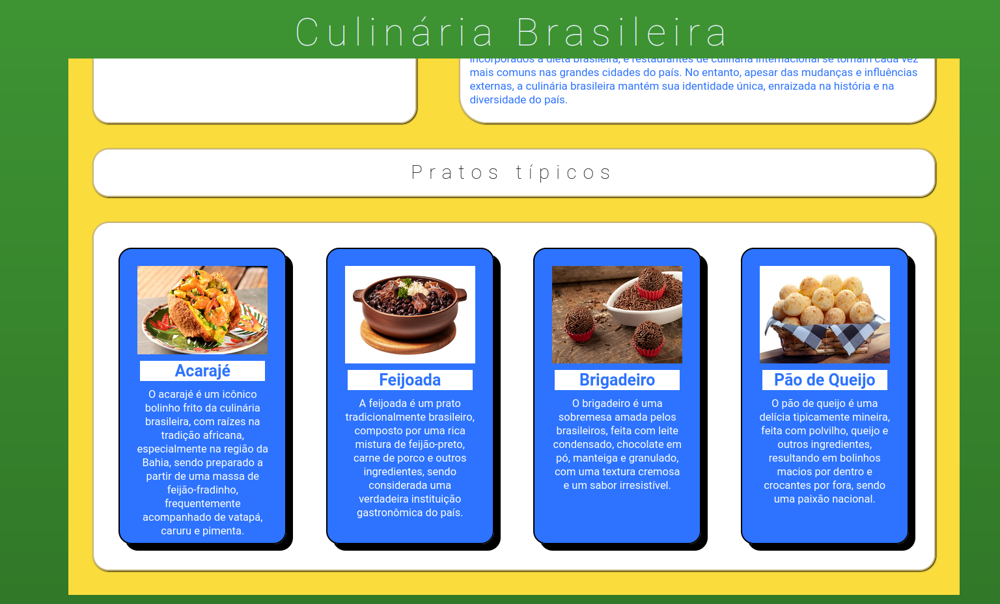

    <h1> Recipes Landing Page 🥪 </h1>

    

    <ul>
        <li> HTML </li>
        <li> CSS </li>
    </ul>

    

     
    
 This is the begginner's project made for the Odin Project Curriculum - a simple display of Recipes made with the essentials of a webpage - <strong> HTML </strong> and <strong> CSS! </strong> From the get go, i wanted the project to be about Brazil's culinary and history, one of my favorite subjects. 

    
In this project, i learned and used for the first time:  

    <ul>
        <li> Media Query for responsive behavior</li>
        <li> CSS Events for interactive behaviorr</li>
    </ul>
     
    
     

