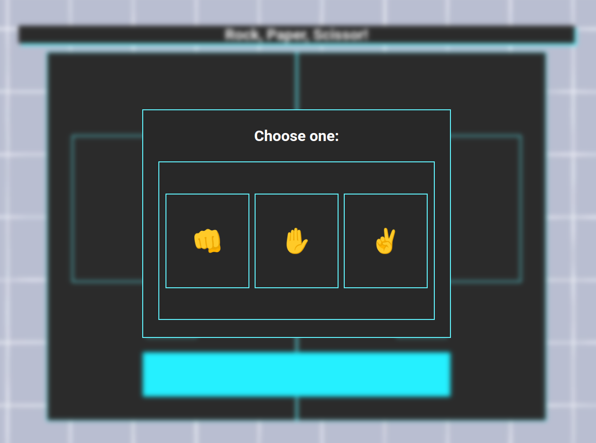

<h1 align = 'center'>Rock, Paper, Scissors!</h1>

<ul> 
    <li><a href = "https://murilosoarez.github.io/Rock-Paper-Scissors/">Live</a>
    </li>
</ul>

 Classic Rock, Paper, Scissors game made following the Odin Project curriculum. This was always made using the basics: <strong>HTML, CSS</strong> and <strong> JS.</strong> It consists basically of basic DOM interaction and the game's flow is made using functions and JS classes.  

-> Symbols from symbol.cc 

 

If you have any tips on how to improve this, please contact me through: 

<ul>
    <li>murilosoliveira18@gmail.com</li>
    <li> @mrlsoares (discord)
</ul>